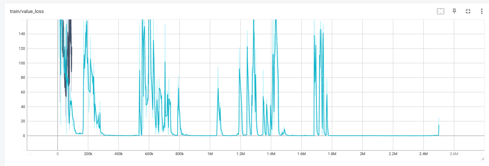
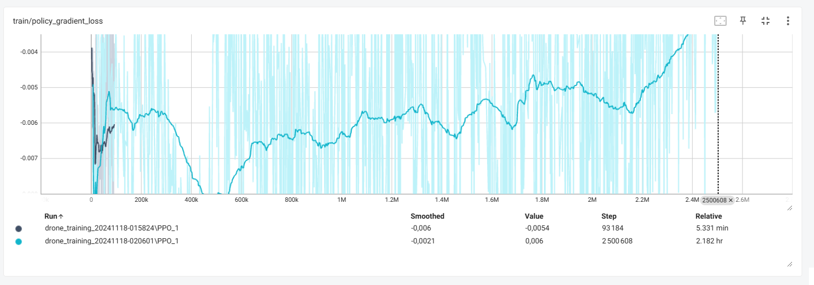

# QuadcopterRL: Reinforcement Learning for Drone Stabilization

A PyBullet-based drone simulation using PPO (Proximal Policy Optimization) for autonomous hover and stabilization.

## Setup and Installation

```bash
# Create environment
conda create -n drone_rl python=3.9
conda activate drone_rl

# Install dependencies
pip install -r requirements.txt
```

## Project Structure
```
QuadcopterRL/
├── drone_env.py          # Drone environment with PyBullet physics
├── run_model.py          # Visualization code
├── train.py             # Training script (optional)
├── requirements.txt     # Package dependencies
├── models/              # Model directory
│   └── drone_final/    # Trained model (2.5M steps)
└── images/             # Training metrics visualizations
```

## Training Metrics




## Run Pre-trained Model
```bash
python run_model.py
```

## Model Details
- Training steps: 2.5M
- Algorithm: PPO (Proximal Policy Optimization)
- Physics: PyBullet engine
- Target behavior: Stable hovering at 1.0m height

## Environment Parameters
- Drone mass: 0.5 kg (body) + 0.2 kg (rotors)
- Max force per rotor: 2.58N
- Hover force needed: 6.87N
- Force per rotor at hover: 1.72N

## Future Improvements
- [ ] Dynamic obstacle integration for collision avoidance
- [ ] Path following with waypoint navigation
- [ ] Moving objects for complex environment interactions
- [ ] Multi-objective learning capabilities

## Requirements
- Python 3.9
- NVIDIA GPU recommended, but not mandatory.
- Key packages in requirements.txt

## Package Versions
```
numpy==1.24.3
torch==2.1.0
gymnasium==0.29.1
pybullet==3.2.5
stable-baselines3==2.1.0
tensorboard==2.14.0
```

## Author
[MOUHAMAD A. Al-amine](https://github.com/alaminerca)

## License
MIT License